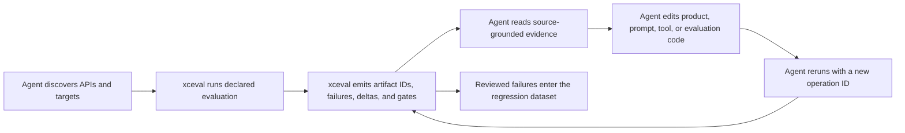

# Evaluations Framework CLI

> [!IMPORTANT]
> `xceval` is a community-defined name and an unofficial tool. It is not an
> Apple command or product, Apple does not use it as the public name of the
> framework, and it is not affiliated with or endorsed by Apple.

`xceval` is an unofficial command-line control plane for Apple Evaluations
workflows. It gives a developer or external coding agent deterministic tools to
discover evaluation targets, scaffold and typecheck framework code, run
producers, export attachments, inspect failures, manage regression datasets,
compare runs, enforce gates, and repeat the loop.

## Why This Exists

Xcode 27 exposes one public command-line operation:

```bash
xcrun xcresulttool export evaluations \
  --path Tests.xcresult \
  --output-path ExportedEvaluations
```

That command extracts attachments, but it does not scaffold producers, run a
multi-stage workflow, inspect, normalize, validate, query, compare, convert, or
gate their contents for scripts and CI. `xceval` fills that tooling gap.

The CLI deliberately does **not** link `Evaluations.framework`. Artifact
inspection uses the documented JSON files directly, so it remains useful when
Xcode 27 is not installed and avoids binding automation to beta framework
round-trip behavior. Typed framework code still runs in your app, package, or
tests; `xceval run` and `xceval test` orchestrate those producers.

## Scope

`xceval` can author the mechanical parts of an evaluation: discover the exact
installed framework API, generate explicit recipe families, typecheck them
against the selected Xcode, scaffold runnable targets, and maintain the data and
evidence contracts around them. It intentionally does not invent what “good”
means. A person or coding agent supplies the feature behavior, representative
inputs, criteria, expected outcomes, judge policy, tool expectations, and
threshold direction.

That split is what makes the complete loop useful. `xceval` owns deterministic
execution and evidence; the external agent owns reasoning and source edits. No
`--agent` flag is needed, and `xceval` never embeds Codex or another agent.

The CLI can begin from a generated starter, a declared producer executable, an
Xcode test with Swift Testing attachments, or existing `.xcevalresult` data.

| Workflow | Owner |
| --- | --- |
| Discover installed Evaluations APIs and generate compile-checked recipes | `xceval api` |
| Generate a working package, test, producer, dataset, target, and pipeline manifest | `xceval init` |
| Define feature semantics, evaluators, judges, tools, and thresholds | Developer or external agent |
| Validate, select, quarantine, and promote versioned datasets | `xceval datasets` |
| Invoke the model and record deployment-specific benchmark measurements | App-specific producer or benchmark harness |
| Discover and launch a declared producer with an idempotent receipt | `xceval targets`, `target`, `run`, `operation` |
| Run Xcode tests and export attached results | `xceval test` |
| Execute named stages and write one complete analysis directory | `xceval pipeline` |
| Select failures and emit compact, source-grounded evidence | `xceval select`, `evidence` |
| Inspect, normalize, compare, convert, and apply absolute or delta gates | `xceval` |

This supports both initial adoption and the repeated
run → inspect → edit → rerun workflow of a mature evaluation suite.

## Build

```bash
git clone https://github.com/rudrankriyam/Evaluations-Framework-CLI.git
cd Evaluations-Framework-CLI
swift build -c release
.build/release/xceval --help
```

The binary runs on macOS 14 or newer. Exporting from `.xcresult` requires an
Xcode installation that provides `xcresulttool export evaluations`, currently
Xcode 27.

Homebrew is the primary install path:

```bash
brew tap rudrankriyam/tap
brew install xceval
```

## Swift Library Products

The package publishes two library products alongside the executable:

- `XCEvalFormat` is the preferred interoperability surface. It contains public
  models and decoders for normalized command output, JSONL samples, target and
  selection manifests, operation receipts, and structured errors.
- `XCEvalCore` exposes the existing artifact, analysis, pipeline, Xcode, and
  process utilities plus target, dataset, authoring, provenance, and safety
  primitives. Its API is experimental while `xceval` remains pre-1.0.

Add the package and select only the product your target needs:

```swift
.package(
    url: "https://github.com/rudrankriyam/Evaluations-Framework-CLI.git",
    from: "0.4.0"
)
```

Decode normalized command output without parsing Apple's persisted schema:

```swift
import Foundation
import XCEvalFormat

let data = try Data(contentsOf: outputURL)
let document = try XCEvalDocumentDecoder.decode(data)

switch document {
case .inspect(let output):
    print(output.artifact.samples?.count ?? 0)
case .samples(let output):
    print(output.samples.count)
case .error(let output):
    print(output.error.code)
default:
    break
}
```

Golden examples and compatibility rules live under
[`Contracts/xceval-v1`](Contracts/xceval-v1) and
[`Contracts/agent-v1`](Contracts/agent-v1). Within a schema version, consumers
must tolerate additive fields. Breaking field or semantic changes require a
new schema version.

[`JudgeCalibrationKit`](https://github.com/Dave861/JudgeCalibrationKit)
independently provides judge-human agreement statistics and calibration gates.
It consumes normalized `xceval/v1` output while keeping calibration policy and
human labels project-owned. `xceval` does not copy, invoke, or depend on that
library.

## First Commands

```bash
# Create a compilable macOS 27 package and ready-to-run pipeline.
xceval init SearchQuality --template deterministic
cd SearchQualityEvaluations
xceval pipeline

# Inspect the exact installed Beta framework and typecheck every recipe.
xceval api show ModelJudgeEvaluator
xceval api example tool-call --type-name SearchToolEvaluation
xceval api verify --xcode /Applications/Xcode-27.0.0-Beta.4.app

# Print supported operations and producer-owned boundaries.
xceval capabilities --output json

# Discover Xcode 27 even when it lives in ~/Downloads.
xceval doctor

# List every result in a file, JSONL collection, or recursive directory.
xceval list ./evaluation-results --output json

# Validate structure while remaining forward-compatible with unknown fields.
xceval validate Results.xcevalresults.jsonl --strict

# Read metadata and aggregate metrics.
xceval inspect Result.xcevalresult --summary-only

# Emit the complete normalized artifact as JSON.
xceval inspect Result.xcevalresult --output json --pretty

# Preserve Apple's exact JSON document.
xceval inspect Result.xcevalresult --output raw-json

# Stream one normalized sample per line.
xceval samples Result.xcevalresult --output jsonl

# Focus on rows containing a failing metric.
xceval samples Result.xcevalresult --only-failures --output json

# Filter evaluator rows without loading the result into another program.
xceval samples Result.xcevalresult \
  --metric "Tool Call Accuracy" --kind fail --output jsonl

# Profile pass, fail, score, ignore, numeric, and rationale counts.
xceval metrics Result.xcevalresult --output json

# Emit the machine-readable data behind Xcode's evaluation report.
xceval report Result.xcevalresult --output json --pretty

# Superset Apple's sample DatasetExtractor output.
xceval dataset Result.xcevalresult --output apple-json --pretty

# Compare aggregate and stable per-sample evidence.
xceval compare Baseline.xcevalresult Candidate.xcevalresult \
  --include-samples --sample-key /input/id --output json

# Give an external agent compact failures and regression evidence, not prose.
xceval evidence Candidate.xcevalresult \
  --baseline Baseline.xcevalresult \
  --sample-key /input/id --regressions-only --output json

# Enforce absolute and candidate-minus-baseline rules you explicitly declare.
xceval gate Result.xcevalresult \
  --rule "Mean of Accuracy>=0.9" \
  --rule "Maximum of Latency<2"
xceval gate Candidate.xcevalresult \
  --baseline Baseline.xcevalresult \
  --delta-rule "Mean of Accuracy>=0"

# Pack or split EvaluationResult JSON Lines collections.
xceval convert ./runs --to jsonl \
  --output-path Results.xcevalresults.jsonl

# Discover and run a declared producer with durable idempotency.
xceval targets --output json
xceval target search-quality --output json
xceval run search-quality \
  --operation-id search-quality-001 \
  --selection .xceval/selections/failures.json \
  --output json
xceval operation search-quality-001 --output json
xceval plan --run-id search-quality-002 --output json

# Legacy producers remain supported without a target manifest.
xceval run --results-path ./results -- \
  swift run MyEvaluationRunner

# Persist stable failures and promote reviewed regression data.
xceval select Candidate.xcevalresult \
  --only-failures --sample-key /input/id \
  --output-path .xceval/selections/failures.json
xceval datasets validate Fixtures/holdout.json --sample-key /id
xceval datasets draft Candidate.xcevalresult \
  --only-failures --sample-key /id \
  --output-path .xceval/drafts/regressions.json
xceval datasets promote .xceval/drafts/regressions.json \
  --into Fixtures/holdout.json \
  --sample-key /id --output-path Fixtures/holdout-next.json

# Run all producer and analysis stages declared in a versioned manifest.
xceval pipeline xceval.pipeline.json

# Run Swift Testing or XCTest through Xcode, then export attachments.
xceval test --xcode ~/Downloads/Xcode-beta.app \
  --working-directory ./MyPackage -- \
  -scheme MyPackage-Package -destination 'platform=macOS' test

# Export evaluation attachments from Swift Testing or Xcode tests.
xceval export Tests.xcresult --output-path ./evaluations --output json

# Print Apple's manifest schema for the selected Xcode.
xceval schema
```

Text is the default in an interactive terminal. JSON is the default when output
is piped. Use `-` as an input path to read a result or collection from stdin.
Use `--output text|json|jsonl|raw-json|apple-json` where supported.

## External Agent Control Loop

The agent is the caller. `xceval` is the tool surface and evidence protocol:



An operation ID makes retries safe; it does not hide a second execution behind
the same request. A selection manifest identifies the exact failing samples a
producer should rerun. Artifact IDs are canonical across JSON formatting, while
byte digests preserve the exact source. Dataset promotion is explicit and never
copies a model response into an expected label.

The loop is intentionally open-ended. Codex, another coding agent, CI, or a
developer can decide what source to inspect and change. `xceval` only reports
facts, executes declared commands, and persists reproducible evidence.

### Declared targets

`.xceval/targets.json` is the discovery boundary between a repository and an
agent:

```json
{
  "schemaVersion": "xceval.targets/v1",
  "targets": [
    {
      "id": "search-quality",
      "kind": "command",
      "workingDirectory": "..",
      "argv": [
        "/usr/bin/xcrun",
        "swift",
        "run",
        "search-evaluate"
      ],
      "environment": {
        "inherit": ["PATH"],
        "set": {}
      },
      "outputs": [
        {
          "role": "evaluation-result",
          "path": ".xceval/results",
          "format": "xcevalresult",
          "minimumCount": 1
        }
      ],
      "requirements": [
        {
          "capability": "apple.evaluations",
          "minimumVersion": "27.0"
        }
      ],
      "sampleKeyPointer": "/id"
    }
  ]
}
```

Each target has a content-derived revision. Environment inheritance is an
allowlist; undeclared parent values are not passed into a declared producer.
Output paths are safety-checked before execution.

## Framework Boundaries

A universal binary cannot execute every generic `Evaluation` inside its own
process. Framework types such as the sample, subject, tools, model judge,
dimensions, credentials, and synthetic-data validator are compiled into the
owning app or package. `xceval api` can generate and verify that Swift, while a
declared target executes it without requiring the CLI to guess application
behavior.

`xceval` instead interoperates with framework capabilities at explicit
boundaries. Rows marked as producer-owned still require app-specific Swift code;
the CLI only launches that code and consumes its persisted output.

| Evaluations capability | `xceval` handling |
| --- | --- |
| Installed interface declarations and source evidence | Discover with `xceval api list` and `api show` |
| Deterministic, model-judge, tool-call, synthetic, and session recipes | Generate and typecheck with `api example`, `api verify`, and `init --template` |
| Starter package with JSON data, `.evaluates`, direct persistence, targets, and gates | Generate with `xceval init` |
| `Evaluation`, custom `Evaluator`, and `Metric` | Run a declared typed producer with `targets`, `target`, and `run` |
| Swift Testing `.evaluates` | Run tests and export attachments with `xceval test` |
| `ArrayLoader`, `JSONLoader`, and `StreamLoader` | Execute in producer code; inspect every stored row |
| Mean, median, mode, min, max, variance, standard deviation, groups, and custom aggregation | Query persisted aggregates with `metrics`, `inspect`, `compare`, and `gate` |
| `ModelJudgeEvaluator`, pairwise mode, score dimensions, and rationales | Execute with the producer; inspect scores and rationales generically |
| `ToolCallEvaluator`, trajectories, transcripts, and all argument matchers | Execute with the producer; filter failures and rationales with `samples` |
| `SampleGenerator`, random or sliding-window strategies, and validators | Run the typed generator executable with `run --allow-empty` |
| `saveJSON`, `loadJSON`, `saveJSONLines`, and `loadJSONLines` workflows | Read, validate, pack, split, and stream with `list`, `validate`, and `convert` |
| Summary and detailed data frames | Normalize with `inspect`, `samples`, `metrics`, and `report` |
| Xcode evaluation reports | Export with Apple’s `xcresulttool` through `export` or `test` |
| Failure evidence and selected reruns | Persist with `select`; emit with `evidence`; pass to `run --selection` |
| Reviewed regression datasets | Discover, validate, select, quarantine, draft, and promote with `datasets` |
| Baseline/control iteration | Compare stable samples and apply explicit candidate-minus-baseline gates |
| End-to-end producer, analysis, comparison, and policy workflow | Declare stages in `xceval.pipeline.json` and run `pipeline` |

Run `xceval capabilities --output json` for the same matrix in a stable,
machine-readable form so scripts can inspect command boundaries without parsing
this README.

## Stable Machine-Readable Output

Artifact analysis commands use the additive envelope `xceval/v1`. Target,
selection, receipt, API, and dataset lifecycle documents use purpose-specific
versioned schemas. Explicit `--output json` failures use `xceval.error/v1` with
a stable code, retryability flag, message, and structured details. All current
documents are publicly decodable through `XCEvalFormat`.

`inspect` exposes:

- Evaluation and result identifiers.
- Start, end, and duration fields.
- Evaluation info and report metadata.
- Flattened aggregate metrics with group and operation details.
- Decoded sample inputs when the `Input` column contains nested JSON.
- Response, expected value, evaluator kind, metric kind, value, and rationale.
- Unknown nonmetric columns without discarding them.
- A canonical artifact ID plus an exact-source byte digest.

`report` combines those rows with:

- Exact numeric values for recreating distributions and histograms.
- Pass, fail, score, ignore, and rationale counts per metric.
- Median, sample variance, and sample standard deviation computed from persisted
  numeric values.
- Structural Subject-versus-Expected issues with JSON paths.
- Optional baseline aggregate comparisons.

This is the machine-readable substance of Xcode 27's evaluation report. The CLI
does not attempt to reproduce Xcode's visual chart rendering.

`evidence` compacts those facts into failing samples, metric rationales,
structural differences, aggregate deltas, and per-sample classifications.
`compare --include-samples` classifies stable keys as regressed, fixed, changed,
added, removed, or unjoinable; duplicate or missing keys are never silently
joined.

`--output raw-json` returns Apple's document unchanged. This gives automation a
stable default while preserving an escape hatch as Apple's beta schema evolves.

Collections can be a single `.xcevalresult`, a JSONL file produced by
`EvaluationResult.saveJSONLines`, a recursive directory, or stdin. Select one
result with `--evaluation-id` or `--result-id`.

## What Apple Stores

A direct `EvaluationResult.saveJSON` call creates a plain JSON document with the
`.xcevalresult` extension. In Xcode 27, its top-level fields include:

- `evaluationID`
- `resultID`
- `startTime`
- `endTime`
- `durationInMilliseconds`
- `evaluationInfo`
- `reportMetadata` when `includeReportMetadata: true` is requested and metadata
  is available
- `results`
- `summary`

Swift Testing's `.evaluates` trait attaches that file to a test. Xcode stores
the attachment inside `.xcresult`; `xceval export` invokes Apple's public
`xcresulttool` command and returns both the exported files and `manifest.json`.

## Xcode Framework Folders

The public developer framework lives here:

```text
Xcode.app/Contents/Developer/Platforms/<Platform>.platform/
Developer/Library/Frameworks/Evaluations.framework
```

Do not confuse it with:

| Location | Meaning |
| --- | --- |
| `Xcode.app/Contents/Frameworks/IDEEvaluationKit.framework` | Private Xcode IDE implementation |
| `Xcode.app/Contents/SharedFrameworks/MLEvaluation*.framework` | Other private ML evaluation support |
| `<Platform>.sdk/System/Library/Frameworks` | Runtime OS SDK frameworks |
| A project's `Frameworks` group | Xcode project metadata |
| An app bundle's `Frameworks` directory | Embedded shipping dependencies |

`xceval doctor --output json` reports every Evaluations developer-framework
copy found for macOS, iOS, watchOS, and visionOS platforms.

## Producer Boundary

The application or package owns typed feature behavior. The standalone CLI owns
authoring assistance, orchestration, and generic evidence:

1. `xceval api` discovers the installed interface and compile-verifies
   authoring recipes without choosing product semantics.
2. `xceval run` launches a declared target, records a durable operation
   receipt, recovers an attempt abandoned by a crashed executor, and discovers
   new or changed `.xcevalresult` files. A live executor retains an exclusive
   lease, so concurrent callers do not duplicate the producer. Every recovered
   attempt writes distinct immutable stdout and stderr logs, preserving the
   abandoned attempt's evidence. Idempotent JSON replays preserve the normal
   `xceval/v1` run envelope and mark `replayed: true`; live observers see a
   `running` nested receipt and no process outcome until execution completes.
3. `xceval test` launches `xcodebuild`, preserves its `.xcresult`, and exports
   evaluation attachments even when tests fail.
4. `xceval` validates, inspects, selects, profiles, compares, converts, and
   gates those artifacts without opening Xcode.
5. `xceval datasets` turns reviewed failures into reproducible regression data.
6. `xceval pipeline` remains the compatibility macro for a fixed manifest
   workflow, while external agents can compose the lower-level commands
   directly.

This keeps the CLI reusable across Foundation Models, server models,
tool-calling systems, deterministic systems, and custom stochastic systems.

## Evaluation Pipeline

A pipeline manifest makes Apple's evaluation lifecycle explicit:

```json
{
  "schemaVersion": "xceval.pipeline/v1",
  "name": "Search quality",
  "workingDirectory": ".",
  "artifactsDirectory": ".xceval/pipeline",
  "resultsPath": ".xceval/results",
  "requiresEvaluationsXcode": true,
  "steps": [
    {
      "name": "evaluate",
      "command": [
        "/usr/bin/xcrun",
        "swift",
        "run",
        "search-evaluate",
        "--output",
        ".xceval/results"
      ]
    }
  ],
  "baseline": "Baselines/search.xcevalresult",
  "gates": [
    "Mean of Accuracy>=0.9",
    "Maximum of Latency<2"
  ]
}
```

Run it with:

```bash
xceval pipeline --set DATASET=Fixtures/holdout.json
```

The output directory contains the selected native result, stage logs,
`inspect.json`, `report.json`, `metrics.json`, `failures.jsonl`, `dataset.json`,
Apple-compatible prompt-response data, validation, optional comparison, gate
results, and `pipeline-report.json`.

## Lessons From Apple's Sample

Apple's Book Tracker sample demonstrates a complete loop rather than a single
test:

1. Start with curated golden examples.
2. Generate and validate broader synthetic samples.
3. Run deterministic evaluators for computable behavior.
4. Use model judges only for subjective dimensions.
5. Extract prompt-response pairs from persisted results.
6. Calibrate judges against human labels with agreement statistics.
7. Compare a baseline and one experimental change.
8. Gate the aggregate result and keep failures as regression samples.

`xceval init` and `api` cover the compilable starting structure and exact
framework surface. Declared targets, receipts, evidence, comparisons, delta
gates, and dataset lifecycle commands cover repeatable iteration. Human labels,
domain-specific synthetic-data validation, and judge calibration policy remain
project-owned because they define what “good” means for the feature.

## Xcode Discovery

For export and schema commands, `xceval` checks:

1. `--xcode`
2. `DEVELOPER_DIR`
3. `xcode-select --print-path`
4. Xcode apps under `/Applications`, `~/Applications`, and `~/Downloads`

This supports side-by-side beta installations without changing the system-wide
selected Xcode.

## Executable Xcode 27 Lab

`Tests/Fixtures/EvaluationsLab` is a throwaway Tuist project pinned to the
release verification shape. It is source-controlled as a manifest and sources;
the generated project and Derived Data are ignored.

```bash
EVALUATIONS_LAB_REQUIRE_TOOLCHAIN=1 \
DEVELOPER_DIR=/Applications/Xcode-27.0.0-Beta.4.app/Contents/Developer \
Tests/Fixtures/EvaluationsLab/Scripts/verify-harness.sh
```

The strict harness:

- Generates the project with Tuist 4.202.2.
- Compiles shared Evaluations code for macOS, iOS Simulator, visionOS
  Simulator, and watchOS Simulator.
- Runs deterministic evaluation, persistence, loader, aggregation, structured
  value, typed result-column, tool-trajectory, and negative-path tests.
- Builds and runs a non-test CLI with the framework search and run paths Apple
  documents for synthetic generation.
- Verifies Swift Testing attachments and Apple `xcresulttool` export.

The broader exploratory suite goes beyond the WWDC walkthroughs with malformed
loader behavior, missing/wrong/duplicate/disallowed tool calls, strict
additional-call policies, custom sample protocols, metadata-inclusive
round-trips, holdout agreement, Cohen’s kappa, baseline/candidate win-tie-loss
analysis, and compile coverage for every authoring recipe. Model-judge and
synthetic-generation runtime lanes remain explicit opt-ins:

```bash
EVALUATIONS_LAB_RUN_MODEL_TESTS=1 \
DEVELOPER_DIR=/Applications/Xcode-27.0.0-Beta.4.app/Contents/Developer \
xcodebuild \
  -project Tests/Fixtures/EvaluationsLab/EvaluationsLab.xcodeproj \
  -scheme EvaluationsLabTests \
  -destination 'platform=macOS' \
  CODE_SIGNING_ALLOWED=NO test
```

Compile coverage is not presented as model-runtime proof, and simulator builds
are not presented as physical-device execution.

## Beta Compatibility

The release fixture verifies default and metadata-inclusive `saveJSON`,
`jsonData`, and JSONL round trips against Xcode 27 Beta 4. It also captures beta
edge behavior instead of assuming ideal failures: a malformed element can make
`JSONLoader` drop valid siblings, a malformed top-level document can yield an
empty loader, and public load errors do not consistently materialize as
`EvaluationResultsError`.

`xceval` therefore keeps persisted JSON as its automation boundary, performs
its own structural validation, and preserves unknown fields. The disposable
Tuist lab under `Tests/Fixtures/EvaluationsLab` is the executable compatibility
specification for the currently installed beta.

## Apple Resources

- [Evaluations documentation](https://developer.apple.com/documentation/evaluations)
- [Meet the Evaluations framework](https://developer.apple.com/videos/play/wwdc2026/298/)
- [Create robust evaluations for agentic apps](https://developer.apple.com/videos/play/wwdc2026/299/)
- [Improve prompts by hill-climbing evaluations](https://developer.apple.com/videos/play/wwdc2026/335/)
- [Designing effective evaluations](https://developer.apple.com/documentation/evaluations/designing-effective-evaluations)
- [Designing evaluation datasets](https://developer.apple.com/documentation/evaluations/designing-evaluation-datasets)
- [Evaluating language model responses](https://developer.apple.com/documentation/evaluations/evaluating-language-model-responses)
- [Designing evaluation criteria](https://developer.apple.com/documentation/evaluations/designing-evaluation-criteria)
- [Designing effective model judges](https://developer.apple.com/documentation/evaluations/designing-effective-model-judges)
- [Scoring with model-as-judge evaluators](https://developer.apple.com/documentation/evaluations/scoring-with-model-as-judge-evaluators)
- [Generating synthetic evaluation datasets](https://developer.apple.com/documentation/evaluations/generating-synthetic-evaluation-datasets)
- [Evaluating tool-calling behavior](https://developer.apple.com/documentation/evaluations/evaluating-tool-calling-behavior)
- [Book Tracker Evaluations sample](https://developer.apple.com/documentation/evaluations/book-tracker-using-evaluations-to-evaluate-an-intelligent-feature)

## License

MIT
